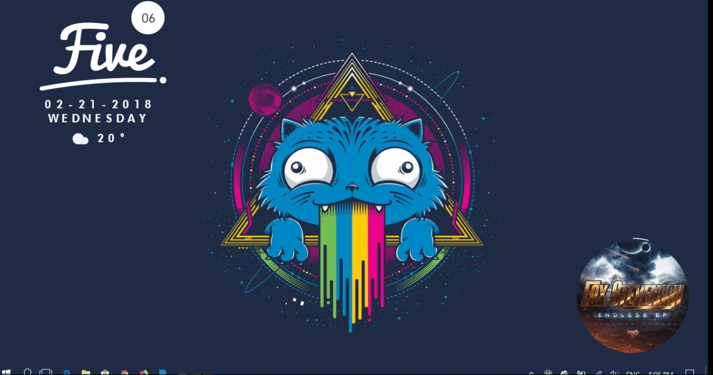
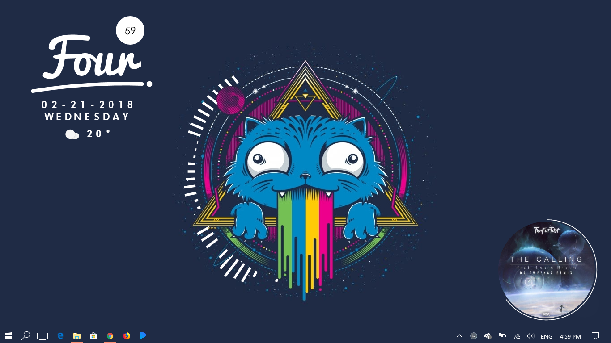

# Rainmeter GalaxyCat
To use the skin, copy the folders to your Rainmeter skins folder, set the wallpaper and install the layouts .rmskin
Adjust cutout and layout for your resolution. My resolutions are 1366x768 (smallscreen) and 1920x1080 (largescreen).

**Demo**

`Recording appears to lag due to the recorded framerate.`

**Screenshot**

# Credits
- 360Music by [Resaph](https://redsaph.deviantart.com/art/360-Music-for-Rainmeter-v6-0-25-Oct-2017-614432622)
- MiniWeather by Jelle Dekkers
- VisBubble by [Undefinist](https://undefinist.deviantart.com/art/VisBubble-Round-Visualizer-for-Rainmeter-488601501)
- mnml UI by [ppick CH](https://github.com/khanhas/mnmlUI)
- VisBubbleTog by Mibo5354
